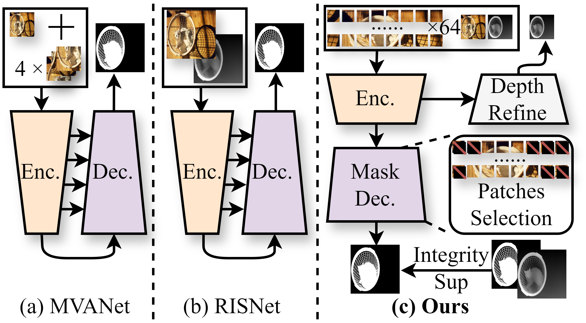
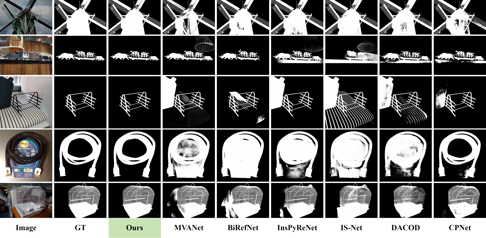

# 🎯 PDFNet

Official PyTorch implementation of [PDFNet](https://arxiv.org/abs/2503.06100) — *Your new best friend for high-precision image segmentation!* ✨

<div align='center'>
<a href='https://arxiv.org/abs/2503.06100'></a>&ensp;
<a href='https://huggingface.co/spaces/Tennineee/PDFNet'></a>&ensp;
<a href='https://github.com/Tennine2077/Awesome-Dichotomous-Image-Segmentation'></a>
</div>

---

## 📝 High-Precision Dichotomous Image Segmentation via Depth Integrity-Prior and Fine-Grained Patch Strategy

**Authors:** Xianjie Liu, Keren Fu, Qijun Zhao

---

## 🔥 What's New?

| Date | News |
|------|------|
| 🎉 **2025/10/23** | [set-soft](https://github.com/set-soft) created a [ComfyUI plugin](https://github.com/set-soft/ComfyUI-RemoveBackground_SET) — now you can use PDFNet even easier! Big thanks! 🙏 |
| 💻 **2025/3/27** | Added Hugging Face Space (CPU mode) — give it a try! Each inference takes ~1 min ⏱️ |
| 🤖 **2025/3/23** | Demo Jupyter notebook is ready! Try it out! 📒 |
| 🚀 **2025/3/13** | Code and checkpoints released on GitHub! |
| 📕 **2025/3/10** | Paper released on arXiv! |

---

## 💡 Why PDFNet?

High-precision dichotomous image segmentation (DIS) sounds fancy, but here's the deal:

**The Problem 😰:**
- Non-diffusion methods → Fast but often miss details or produce false detections
- Diffusion methods → Accurate but sloooow and computationally expensive

**Our Solution 🎯:**

We discovered something cool — **Depth Integrity-Prior**! 🪄

> In pseudo depth maps, foreground objects have stable depth values with *much lower variance* than chaotic backgrounds!



---

## 🛠️ Installation

Super easy setup! Just run:

```bash
# Create environment
conda create -n PDFNet python=3.11.4
conda activate PDFNet

# Install dependencies
pip install -r requirements.txt
```

---

## 📦 Dataset Preparation

### Step 1: Get the Data 📥

Download the [DIS-5K dataset](https://github.com/xuebinqin/DIS) and organize like this:

```
PDFNet
└── DATA
    └── DIS-DATA
        ├── DIS-TE1 📁
        ├── DIS-TE2 📁
        ├── DIS-TE3 📁
        ├── DIS-TE4 📁
        ├── DIS-TR 📁
        └── DIS-VD 📁
            ├── images 🖼️
            └── masks 🎭
```

### Step 2: Get the Backbone 🦴

Download [Swin-B weights](https://github.com/SwinTransformer/storage/releases/download/v1.0.0/swin_base_patch4_window12_384_22k.pth) → put in `checkpoints` folder

### Step 3: Generate Depth Maps 🗺️

1. Clone [Depth Anything V2](https://github.com/DepthAnything/Depth-Anything-V2) into `DAM-V2`
2. Download [DAM-V2 weights](https://github.com/DepthAnything/Depth-Anything-V2) → `checkpoints`
3. Run `DAM-V2/Depth-prepare.ipynb` to generate pseudo-depth maps

---

## 🚀 Training

Let's train this beast! 🦁

```bash
python Train_PDFNet.py
```

### 🎛️ Key Arguments

| Argument | Default | What it does |
|----------|---------|--------------|
| `--batch_size` | 1 | Batch size (bigger = more VRAM needed) |
| `--epochs` | 100 | Training epochs |
| `--lr` | 1e-5 | Learning rate |
| `--input_size` | 1024 | Input resolution |
| `--model` | PDFNet_swinB | Model variant |
| `--device` | cuda | GPU or CPU |
| `--eval_metric` | F1 | Evaluation metric (F1 or MAE) |

Want to use custom datasets? Edit `dataloaders/Mydataset.py` → `build_dataset` function! 🔧

---

## 🧪 Testing & Evaluation

1️⃣ Configure paths in `metric_tools/Test.py`:
   - Set `save_dir` for your outputs
   - Update `gt_roots` and `cycle_roots` in `soc_metric.py`

2️⃣ Run evaluation:
```bash
cd metric_tools
python Test.py
```

---

## 📥 Pre-trained Weights

| Training Data | What You Get |
|---------------|--------------|
| DIS-5K TR | [📦 Checkpoint + Visual Results](https://drive.google.com/drive/folders/1dqkFVR4TElSRFNHhu6er45OQkoHhJsZz?usp=sharing) |
| HRSOD-TR + UHRSD-TR | [🎨 Visual Results Only](https://drive.google.com/file/d/1DKL1Jonx_PR1HF6m0D4lyUQtAmR7oQrd/view?usp=sharing) |

---

## 🎮 Quick Demo

Just want to try it out? Open `demo.ipynb` and have fun! 🎉

---

## 👀 Visual Results

Seeing is believing! Check out how we compare:



---

## 🏗️ Project Structure

```
PDFNet
├── 📄 args.py              # Argument parser
├── 📄 main.py              # Main training loop
├── 📄 Train_PDFNet.py      # Training entry point
├── 📄 utiles.py            # Utilities (optimizer, eval)
├── 📒 demo.ipynb           # Quick demo notebook
├── 📄 requirements.txt     # Dependencies
├── 📂 dataloaders/
│   └── 📄 Mydataset.py     # Dataset + augmentations
├── 📂 models/
│   ├── 📄 PDFNet.py        # The star of the show! ⭐
│   ├── 📄 swin_transformer.py  # Backbone
│   └── 📄 utils.py         # Loss functions
├── 📂 metric_tools/
│   ├── 📄 metrics.py       # F1, MAE, S-m, E-m
│   ├── 📄 F1torch.py       # F1 calculation
│   └── 📄 Test.py          # Testing script
└── 📂 DAM_V2/
    └── 📒 Depth-prepare.ipynb  # Depth generation
```

---

## 🧠 Model Architecture

PDFNet = Three powerful components working together:

```
┌─────────────────────────────────────────────────────┐
│  📸 Encoder (Swin Transformer Base)                 │
│     → Multi-scale feature extraction                │
├─────────────────────────────────────────────────────┤
│  🔮 FSE Module (Fine-grained Semantic Enhancement)  │
│     ├── CoA: Cross-attention for RGB-Depth-Patch    │
│     └── BIS: Boundary-aware Integrity Selection     │
├─────────────────────────────────────────────────────┤
│  📤 Decoder                                         │
│     → Multi-scale output with deep supervision      │
└─────────────────────────────────────────────────────┘
```

### 🎯 Loss Functions We Use

| Loss | Purpose |
|------|---------|
| 📊 **Structure Loss** | Edge-weighted BCE + IoU |
| 🖼️ **SSIM Loss** | Structural similarity |
| 🎯 **Integrity Prior Loss** | Depth consistency in foreground |
| 📏 **SiLog Loss** | Scale-invariant depth loss |

---

## 🤝 Related Resources

Interested in DIS? Check these out:

- 🌟 [Awesome Dichotomous Image Segmentation](https://github.com/Tennine2077/Awesome-Dichotomous-Image-Segmentation) — A curated list of DIS resources!

---

## 📖 Citation

Found PDFNet helpful? Please cite us! 📚

```bibtex
@misc{liu2025highprecisiondichotomousimagesegmentation,
      title={High-Precision Dichotomous Image Segmentation via Depth Integrity-Prior and Fine-Grained Patch Strategy}, 
      author={Xianjie Liu and Keren Fu and Qijun Zhao},
      year={2025},
      eprint={2503.06100},
      archivePrefix={arXiv},
      primaryClass={cs.CV},
      url={https://arxiv.org/abs/2503.06100}, 
}
```

---

## 📜 License

Check out the [LICENSE](LICENSE) file for details.

---

## 🙏 Acknowledgments

Big thanks to:

- 🗂️ [DIS Dataset](https://github.com/xuebinqin/DIS) — Amazing benchmark!
- 🏔️ [Depth Anything V2](https://github.com/DepthAnything/Depth-Anything-V2) — Great depth estimation!
- 🦁 [Swin Transformer](https://github.com/microsoft/Swin-Transformer) — Powerful backbone!

---

<div align='center'>

**Happy Segmenting! 🎉**

Made with ❤️ by the PDFNet Team

</div>
