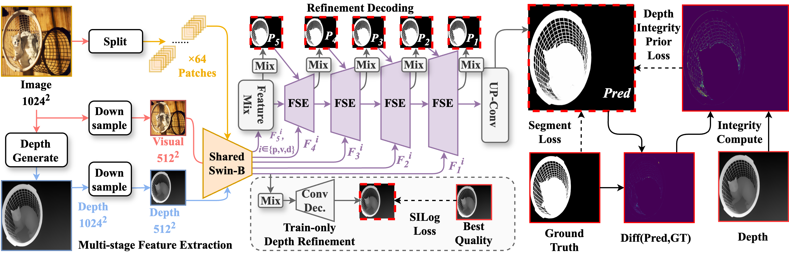

# 🎯 PDFNet

[PDFNet](https://arxiv.org/abs/2503.06100) 的官方 PyTorch 实现 — *高精度图像分割* ✨

<div align='center'>
<a href='https://arxiv.org/abs/2503.06100'></a>&ensp;
<a href='https://huggingface.co/spaces/Tennineee/PDFNet'></a>&ensp;
<a href='https://github.com/Tennine2077/Awesome-Dichotomous-Image-Segmentation'></a>&ensp;
<a href='README.md'></a>
</div>

---

## 📝 基于深度完整性先验与细粒度Patch策略的高精度二分图像分割

**作者:** 柳先杰, 傅可人, 赵启军

---

## 🔥 最新动态

| 时间 | 新闻 |
|------|------|
| 🎉 **2026/3/5** | 被 CVPR2026 接收啦！恭喜！🎊 |
| ✨ **2025/10/23** | [set-soft](https://github.com/set-soft) 大佬创建了 [ComfyUI 插件](https://github.com/set-soft/ComfyUI-RemoveBackground_SET) — 使用更方便啦！感谢大佬！🙏 |
| 💻 **2025/3/27** | Hugging Face Space 上线啦 (CPU模式) — 快来试试，每次推理约1分钟 ⏱️ |
| 🤖 **2025/3/23** | 演示用的 Jupyter notebook 准备好了！开箱即用！📒 |
| 🚀 **2025/3/13** | 代码和预训练权重正式发布！|
| 📕 **2025/3/10** | 论文在 arXiv 发布！|

---

## 💡 为什么选择 PDFNet？

高精度二分图像分割（DIS）听起来很高大上，但现状是这样的：

**现有方法的困境 😰:**
- 非扩散方法 → 快是快，但经常漏检或误检，细节处理差
- 扩散方法 → 效果好是好，但慢得要命，还吃显存

**我们的解决方案 🎯:**

我们发现了一个有趣的现象 — **深度完整性先验**！🪄

> 在伪深度图中，前景物体的深度值非常稳定，方差远小于那些杂乱无章的背景！



---

## 🛠️ 安装

超级简单的几步！

```bash
# 创建环境
conda create -n PDFNet python=3.11.4
conda activate PDFNet

# 安装依赖
pip install -r requirements.txt
```

---

## 📦 数据集准备

### 第一步：下载数据 📥

下载 [DIS-5K 数据集](https://github.com/xuebinqin/DIS)，按下面结构放置：

```
PDFNet
└── DATA
    └── DIS-DATA
        ├── DIS-TE1 📁
        ├── DIS-TE2 📁
        ├── DIS-TE3 📁
        ├── DIS-TE4 📁
        ├── DIS-TR 📁
        └── DIS-VD 📁
            ├── images 🖼️
            └── masks 🎭
```

### 第二步：下载骨干网络 🦴

下载 [Swin-B 权重](https://github.com/SwinTransformer/storage/releases/download/v1.0.0/swin_base_patch4_window12_384_22k.pth) → 放到 `checkpoints` 文件夹

### 第三步：生成深度图 🗺️

1. 将 [Depth Anything V2](https://github.com/DepthAnything/Depth-Anything-V2) 克隆到 `DAM-V2` 目录
2. 下载 [DAM-V2 权重](https://github.com/DepthAnything/Depth-Anything-V2) → 放到 `checkpoints`
3. 运行 `DAM-V2/Depth-prepare.ipynb` 生成伪深度图

---

## 🚀 训练

开始训练吧！🦁

```bash
python Train_PDFNet.py
```

### 🎛️ 主要参数说明

| 参数 | 默认值 | 说明 |
|------|--------|------|
| `--batch_size` | 1 | 批次大小（越大显存吃得越多）|
| `--epochs` | 100 | 训练轮数 |
| `--lr` | 1e-5 | 学习率 |
| `--input_size` | 1024 | 输入分辨率 |
| `--model` | PDFNet_swinB | 模型变体 |
| `--device` | cuda | GPU 还是 CPU |
| `--eval_metric` | F1 | 评估指标 (F1 或 MAE) |

想用自定义数据集？修改 `dataloaders/Mydataset.py` 里的 `build_dataset` 函数就行！🔧

---

## 🧪 测试与评估

1️⃣ 在 `metric_tools/Test.py` 中配置路径：
   - 设置 `save_dir` 为你的输出目录
   - 在 `soc_metric.py` 中更新 `gt_roots` 和 `cycle_roots`

2️⃣ 运行评估：
```bash
cd metric_tools
python Test.py
```

---

## 📥 预训练权重

| 训练数据 | 你能获得什么 |
|----------|-------------|
| DIS-5K TR | [📦 权重 + 可视化结果](https://drive.google.com/drive/folders/1dqkFVR4TElSRFNHhu6er45OQkoHhJsZz?usp=sharing) |
| HRSOD-TR + UHRSD-TR | [🎨 仅可视化结果](https://drive.google.com/file/d/1DKL1Jonx_PR1HF6m0D4lyUQtAmR7oQrd/view?usp=sharing) |

---

## 🎮 快速体验

只是想试试效果？打开 `demo.ipynb` 玩玩看！🎉

---

## 👀 可视化效果

眼见为实！看看我们的对比效果：


---

## 🏗️ 项目结构

```
PDFNet
├── 📄 args.py              # 参数解析器
├── 📄 main.py              # 主训练循环
├── 📄 Train_PDFNet.py      # 训练入口
├── 📄 utiles.py            # 工具函数（优化器、评估）
├── 📒 demo.ipynb           # 快速演示笔记本
├── 📄 requirements.txt     # 依赖项
├── 📂 dataloaders/
│   └── 📄 Mydataset.py     # 数据集加载 + 数据增强
├── 📂 models/
│   ├── 📄 PDFNet.py        # 主角登场！⭐
│   ├── 📄 swin_transformer.py  # 骨干网络
│   └── 📄 utils.py         # 损失函数
├── 📂 metric_tools/
│   ├── 📄 metrics.py       # F1, MAE, S-m, E-m 指标
│   ├── 📄 F1torch.py       # F1 计算
│   └── 📄 Test.py          # 测试脚本
└── 📂 DAM_V2/
    └── 📒 Depth-prepare.ipynb  # 深度图生成
```

---

## 🧠 模型架构

PDFNet = 三大模块强强联手：

```
┌─────────────────────────────────────────────────────┐
│  📸 编码器 (Swin Transformer Base)                  │
│     → 多尺度特征提取                                 │
├─────────────────────────────────────────────────────┤
│  🔮 FSE 模块 (细粒度语义增强)                        │
│     ├── CoA: RGB-深度-Patch 交叉注意力               │
│     └── BIS: 边界感知完整性选择                      │
├─────────────────────────────────────────────────────┤
│  📤 解码器                                          │
│     → 多尺度输出 + 深度监督                          │
└─────────────────────────────────────────────────────┘
```

### 🎯 损失函数一览

| 损失 | 作用 |
|------|------|
| 📊 **Structure Loss** | 边缘加权 BCE + IoU |
| 🖼️ **SSIM Loss** | 结构相似性 |
| 🎯 **Integrity Prior Loss** | 前景区域的深度一致性 |
| 📏 **SiLog Loss** | 尺度不变深度损失 |

---

## 🤝 相关资源

对二分图像分割感兴趣？这些资源你可能喜欢：

- 🌟 [Awesome Dichotomous Image Segmentation](https://github.com/Tennine2077/Awesome-Dichotomous-Image-Segmentation) — DIS 资源大合集！

---

## 📖 引用

觉得 PDFNet 有帮助？请引用我们的论文！📚

```bibtex
@misc{liu2025highprecisiondichotomousimagesegmentation,
      title={High-Precision Dichotomous Image Segmentation via Depth Integrity-Prior and Fine-Grained Patch Strategy}, 
      author={Xianjie Liu and Keren Fu and Qijun Zhao},
      year={2025},
      eprint={2503.06100},
      archivePrefix={arXiv},
      primaryClass={cs.CV},
      url={https://arxiv.org/abs/2503.06100}, 
}
```

---

## 📜 许可证

详情请查看 [LICENSE](LICENSE) 文件。

---

## 🙏 致谢

感谢以下项目：

- 🗂️ [DIS 数据集](https://github.com/xuebinqin/DIS) — 超棒的基准数据集！
- 🏔️ [Depth Anything V2](https://github.com/DepthAnything/Depth-Anything-V2) — 优秀的深度估计模型！
- 🦁 [Swin Transformer](https://github.com/microsoft/Swin-Transformer) — 强大的骨干网络！

---

<div align='center'>

**分割愉快！🎉**

PDFNet 团队用 ❤️ 打造

</div>